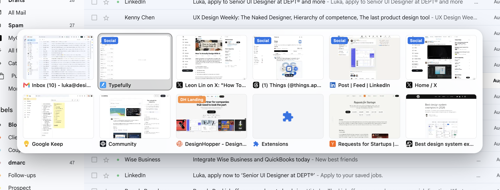

# MRU Tab Switcher

Arc-style most-recently-used tab switching for Chrome. Hold `Control` and tap
`Tab` to cycle through up to 12 recent tabs in a translucent overlay showing
live page thumbnails; release `Control` to jump to the highlighted tab. Hover
and click work too, and `Escape` cancels.

On `chrome://` pages the overlay can't be drawn at all — see
[Restricted pages](#restricted-pages) for how it degrades there.

## Install

1. `chrome://extensions` → enable **Developer mode** → **Load unpacked** →
   select this folder.
2. Approve the host permission prompt. It's needed for `captureVisibleTab` to
   screenshot tabs for the thumbnails; nothing leaves the machine.
3. Bind `Ctrl+Tab` — see below.

## Binding Ctrl+Tab

`Ctrl+Tab` **cannot** be set from `manifest.json` or from the keyboard-shortcuts
UI. Chrome reserves it, and `Tab` was removed from the allowed command keys in
Chrome 33 — putting it in the manifest doesn't just get ignored, it can stop the
extension loading. The manifest therefore declares a harmless `MacCtrl+Q`
default, and the real binding is applied through a private API that bypasses
that restriction.

Open `chrome://extensions/shortcuts`, open DevTools (`⌘⌥J`), write "allow pasting and run it, after that paste this:

```js
chrome.developerPrivate.getExtensionsInfo()
  .then(l => {
    var e = l.find(x => x.name.includes('MRU'));
    chrome.developerPrivate.updateExtensionCommand({
      extensionId: e.id,
      commandName: 'cycle-tabs',
      keybinding: 'Ctrl+Tab',
    });
    console.log('bound', e.name, e.id);
  });
```

Reload the page; the row should read `⌃Tab`.

Notes:

- Use `Ctrl`, not `MacCtrl`. `MacCtrl` is a manifest-level token that this API
  rejects — it silently clears the binding to "Not set" instead of erroring.
- The binding lives in Chrome's preferences keyed by extension ID, not in this
  repo. The unpacked ID is derived from the folder path, so it survives reloads,
  but re-run the snippet if it ever reverts.
- This takes over Chrome's native `Ctrl+Tab` / `Ctrl+Shift+Tab` tab navigation.
  `Cmd+Opt+→/←` still moves between adjacent tabs.
- If DevTools refuses to paste, type `allow pasting` into the console once.

## How it works

The service worker tracks per-window MRU order (persisted to session storage so
it survives service-worker restarts) and caches a downscaled WebP screenshot of
each tab as you leave it. On the shortcut it freezes the current MRU list, shows
`overlay.js` in the active tab, and advances the highlight on each press. The
overlay watches for the real `keyup` and reports the chosen index back.

| File | Responsibility |
| --- | --- |
| `background.js` | Entry point: wires Chrome events, serialises commands per window, builds a cycle's tab list |
| `lib/mru.js` | Per-window most-recently-used order and its session-storage mirror |
| `lib/thumbnails.js` | Screenshot capture, downscaling, and the two-tier (memory + disk) cache |
| `lib/cycle.js` | Cycle state, overlay messaging, and expiry backstops |
| `lib/tabs.js`, `lib/async.js`, `lib/log.js` | Shared helpers |
| `overlay.js` | The on-page panel; owns the `keyup` that ends a hold |

The service worker is an ES module (`"type": "module"` in the manifest), so
`lib/` is imported directly — no bundler.

### Other extensions restyling the panel

The panel lives in a **closed** shadow root. Dark Reader walks every *open*
shadow root on a page via `element.shadowRoot` and injects its own stylesheets
into it — with an open root it turned the panel dark and the selection
near-black on top of it, so the highlighted tab disappeared on every site it
was darkening. It offers no per-element opt-out; its only lock is a page-wide
`<meta name="darkreader-lock">` that would switch it off for the whole site,
which an extension must never inject into someone else's page. A closed root
makes `element.shadowRoot` return `null`, and the overlay never needed it —
`shadow` is its own handle. The same protection applies to any other
extension or page script that restyles whatever it can reach.

Dark Reader's *Filter* modes still apply because they filter the whole page,
panel included; only its default *Dynamic* mode is kept out.

### Layout

At full size six 190px columns need about 1180px, so a narrower window — two
side by side on a laptop, say — used to clip the outer columns off both edges,
the current tab included. The grid now fits the window: cards shrink first,
down to `MIN_CARD_WIDTH_PX` (140), which keeps the one-row-up-to-six,
then-two-rows shape through moderately narrow windows; only below that does a
column go and the tabs flow onto another row. A window too short for every row
scrolls inside the panel, and the selection is kept in view.

The panel eases in over 140ms on first appearance — front-loaded, so it is
over half opaque one frame after it appears and never reads as delay. A rebuild
mid-cycle (a tab closing) does not replay it. macOS "Reduce motion" drops the
animation, and "Reduce transparency" swaps the frosted panel for an opaque one.

### Pointer vs keyboard selection

Hovering a card selects it, but only after the pointer travels
`HOVER_ENGAGE_PX` (12px) from where it sat when the keyboard last acted. The
panel appears centred, often directly under a resting cursor, and treating any
movement as intent meant a pixel of drift handed the selection to whatever card
happened to be underneath — so releasing the modifier switched to the wrong tab.

Every keyboard step re-anchors the pointer, so the most recent *deliberate*
input wins in both directions: cycling takes the selection back from a parked
cursor, and a real mouse movement takes it back from the keyboard. Clicks are
unambiguous and always act on the card clicked, threshold or not.

### Clicking while held

macOS treats Control+click as a secondary click, so with the switcher's own
modifier down a card click arrives as `contextmenu` and never as `click` — the
page's menu would open over the panel and nothing would be selected. The overlay
suppresses `contextmenu` anywhere inside the panel and treats a hit on a card as
the pick it was meant to be. On Windows and Linux the handler never fires.

### Ending the hold

Keyboard events go to whichever frame has focus, so the top document alone is
not enough to catch the release — with focus inside an iframe the panel would
hang on screen. `overlay.js` therefore runs in all frames: sub-frames draw
nothing and only forward a release to the background, which broadcasts the
teardown rather than assuming the sender owned the panel.

Focus in browser UI (the omnibox, DevTools) is not recoverable that way — no
frame sees any key event at all. So the panel polices its own lifetime with an
interval **in the page**, not a timer in the service worker: MV3 suspends the
worker between events and drops pending `setTimeout`s, which is why a missed
release used to leave the panel up indefinitely.

Each tick re-checks `document.hasFocus()`. Unfocused and idle past
`UNFOCUSED_IDLE_MS` (700ms) it commits — there is no release to wait for, and
pressing the shortcut was a request to switch, so honouring it beats discarding
it. That figure is the visible hang in this case, so it is kept only as long as
a comfortable tap cadence needs. Focused and idle past `MAX_PANEL_MS` (30s) it
cancels instead: at that distance the highlighted tab is no longer a safe guess
at intent. Window blur, tab hide, and a mousedown outside the panel also cancel.

The overlay additionally records when it last saw a release, from page load
rather than from when the panel paints, and reports it back. A cold service
worker can take long enough to restore its caches that a quick tap-and-release
finishes before the panel exists; the timestamp survives even though the event
does not, and `startCycle` commits immediately when it sees one newer than the
keypress.

Everything before the overlay's first paint is on the critical path: if it
appears later than the release of a quick tap, the panel just flashes and
vanishes. So `overlay.js` is declared as a content script (already resident, one
message to paint, with `executeScript` only as a fallback for tabs that predate
the extension loading), and the tab list is gathered with a single
`chrome.tabs.query` rather than a `chrome.tabs.get` per entry.

Commands are queued per window, because OS key-repeat can deliver a new command
before the previous one's async work has finished.

### Background-opened tabs

A tab opened in the background (cmd-clicking a link) is slotted in at index 1 —
index 0 being the tab you are on, so 1 is the first thing the switcher offers.
Open several and the newest leads, matching most-recently-used order.

Without this they never entered the list at all: the MRU order is built from tab
*activations*, and a background tab has never been activated, so the one tab you
most likely wanted was the one tab the switcher could not reach.

### Restricted pages

Chrome forbids content scripts on `chrome://` pages and the Web Store, so no
overlay can render *on* one. Pressing the shortcut there switches straight to
the previous tab — where one press lands anyway — and shows the panel on that
tab instead, with the same list and highlight, so holding the modifier keeps
cycling as usual (`continueOnTarget`). The frosted panel hides most of the page
change behind it. If the previous tab is a browser page too, the switch still
happens but there is no panel.

The hard case is a quick tap-and-release that lets go *before* the switch: the
release lands on the browser page, where nothing can hear it, so the panel on
the new tab waits for a keyup that already happened. The overlay is told it
`landed` in that situation, and since its highlight is then always the tab you
are already on, closing is always correct. It closes at the first sign the hold
is over — a mouse move or scroll without the modifier, any typing — or after
`LANDED_IDLE_MS` (900ms) with no further press. Another press, or pointer
movement with the modifier still down, hands back to the ordinary keyup path.

An earlier version of this path was removed because it could not detect that
release at all, and an old "blind" cycle state on these pages caused a long
tail of bugs. What changed: the overlay now records releases from page load and
reports them back (catching a release after the switch but before the panel
paints), it polices its own lifetime in the page rather than via service-worker
timers, and the landed rule covers the one release no page can see.

The window is claimed before the switch, and thumbnail capture re-checks for a
running cycle on each side of the screenshot, so a capture of the new tab can
never catch the panel mid-appearance — thumbnails are cached by URL, so one
that did would stick.

A cycle only exists while a panel is on screen or about to be. Its expiry never
switches tabs: timing out means we lost track of the hold, not that you chose
the highlighted tab.

**Expiry is enforced by timestamp, not by the timer.** MV3 service workers are
suspended between events and pending `setTimeout` callbacks are dropped, so a
timer is best-effort only. Each cycle is stamped with `touchedAt` and staleness
is checked when a command arrives. Building on the timer alone caused a
memorable bug: one activation from a `chrome://` page created blind state whose
timer never fired, so every later press took the blind path and the overlay
never appeared again until the extension was reloaded. If you add state here,
stamp it and check it on arrival — do not trust a timer to clean it up.

### Tab groups

A tab in a named Chrome tab group gets a small badge in the top-left of its
thumbnail, tinted with that group's own colour (`chrome.tabGroups` reports a
colour *name*, so `GROUP_COLORS` in `overlay.js` maps those to Chrome's
palette). Unnamed groups get no badge — a nameless pill communicates nothing.
Each palette entry carries its own text colour: yellow and orange take dark
text, since white on either is roughly 2:1 contrast. Groups are fetched with a
single `chrome.tabGroups.query` alongside the tab query, in the same parallel
step, since this is on the pre-paint critical path.

### Thumbnails

Screenshots are captured on tab activation, on navigation completing in the
active tab, and when a window regains focus — throttled to one capture per tab
per 500ms, since redirect chains fire several events in a row.

The cache is keyed by **URL**, not tab id, and persisted to
`chrome.storage.local` (capped at 60 entries, oldest evicted). That means a
preview outlives both the tab and the browser session: a tab restored at startup
shows its previous thumbnail immediately, and so does a brand-new tab opened on
a page seen before. Tab ids can't do this — Chrome reassigns them on restart.
Entries carry a timestamp so the LRU order survives a restart too, and the whole
set is loaded on worker wake to keep the render path in memory.

Nothing is stored at full resolution. Each capture is downscaled to
`THUMB_WIDTH_PX` (400 — the card renders at 190, so this covers a 2x display
with nothing spare) and re-encoded as WebP at quality 0.6, landing around
10-18KB per entry; the original capture is discarded. Width and quality are the
knobs if that needs tuning. WebP is safe here because only Chrome ever decodes
these, but `convertToBlob` silently falls back to PNG for a type it can't
encode, so the result is checked and re-encoded as JPEG rather than trusted.
Turn on `DEBUG` to log the real encoded size of each thumbnail.

Chrome still cannot screenshot a *background* tab — `captureVisibleTab` only
ever sees the visible one — so a page never visited has no preview to reuse and
falls back to its favicon. The alternatives were briefly activating every tab
(visible flicker) and `chrome.debugger` (a permanent "started debugging this
browser" infobar); both are worse than a placeholder.

**Privacy:** this writes page screenshots to disk. Only `http(s)` pages are
cached, but a screenshot captures whatever was on the page, signed-in content
included. To wipe the cache, run `chrome.storage.local.clear()` in the service
worker console (`chrome://extensions` → **service worker**).

## License

[MIT](LICENSE) © Luka Krcmar
